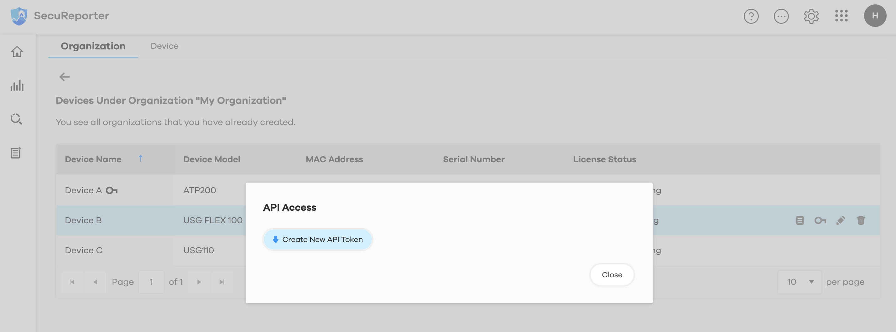

# Introduction

### Accessing Device Data with SecuReporter Open API Service 

SecuReporter supports an interface for software to directly interact with the SecuReporter cloud platform. These APIs empower SecuReporter users to retrieve device logs from the past 31 days using an API token.  

With the `SecuReporter Open API`, you can easily access your device data through HTTP requests using any programming language or cURL commands. To utilize this service, __ensure that your device has a valid SecuReporter license and an Open API Token__. These credentials are necessary to authenticate and authorize your requests to the API. 


# Requirements
### SecurReporter License
Your device requires a valid SecuReporter license. If your license has expired, please contact the device's owner. Purchase the license from [Zyxel marketplace](https://marketplace.zyxel.com/) to access `Open API Service`.

### Open API Token
The `Open API Service` is authorized using `Open API Token` generated by the `agent role` on the SecurReporter portal.

__Your `Open API Token` is a secret!__ Users access the device data with `Open API Token` and do not require MZC account. Never share it with unrelated parties. Ensure that production requests are routed exclusively through your own backend server where your `Open API Token` can be securely loaded from an environment variable or key management service.
 
If you haven't generated `Open API Token` yet, you can get [Quick Start](#quick-start) section.
If you obtain the `Open API Token`, proceed to the [Setup API Token and Make Your First Open API Call](#add-open-api-token-to-environment-variable-recommended) sections.

# Authentication
### Request Header
Every HTTP request must have an `Open API Token` in the `X-Authorization` header and specify the `Content-Type` in the header as follows:

```bash
X-Authorization: Bearer $OPEN_API_TOKEN
Content-Type: application/json
```

# Open API Service
The current available `Open API Service` is as follows, and each service has corresponding `quota usage limits`. For details, please refer to each service.

- [Archive Logs Service](./doc/archive-logs-service.md)
---
# Quick Start
### Confirm the Device's Valid License 
1. Click the More button and select "Organization & Device".

2. Select the organization to which the device belongs.

2. Confirm the device `License Status` and check the remaining validity duration.


### Generate Open API Token on SecurReporter
The `Open API Token` operation is restricted to the `device's agent role`. Alternatively, contacting the device's owner to request authorization and acquire the device's `Open API Token` for access privileges.

1. Select the device with valid SecuRepoter license and click "API Access" button.

2. Click "Create New API Token".

3. Copy the Open API Token.


### Add Open API Token to Environment Variable (Recommended)
<details>
    <summary>macOS</summary>

1. Open Terminal
    Launch the Terminal application from your Applications folder.
2. Edit Bash Profile
    In the Terminal window, type and execute the following command to open your bash profile in a text editor:
    ```shell
    vi ~/.bash_profile
    ```
3. Add Environment Variable
    Press `i` to switch the text editor to insert mode.Then, add the following line to set your environment variable, replacing `your-open-api-token` with the token you copied above.

    ```shell
    export OPEN_API_TOKEN='your-open-api-token'
    ```
4. Save and Exit
    Press `esc` to switch the text editor to command mode.Type `:wq` and press enter to save changes and exit the text editor.
5. Load Your Profile
    To apply the changes, execute the following command in the Terminal:
    ```shell
    source ~/.bash_profile
    ```
6. Verify Environment Variable
    To Verify that the environment variable is set correctly, open your Terminal and execute the command below. If set correctly, it should reveal your `Open API Token`.
    ```shell
    echo $OPEN_API_TOKEN
    ```
</details>

<details>
    <summary>Windows</summary>

1. Access System Properties
    Right-click on `This PC` and click on `Properties`.
2. Open Advanced System Settings
    In the System Properties window, click on `Advanced system settings`.
3. Navigate to Environment Variables
    Click the `Environment Variables` button.
4. Add Environment Variables
    Under the `System variables` section, click `New...`.Then, add the following information to set your environment variable, replacing `your-open-api-token` with the token you copied above.
    `variable: OPEN_API_TOKEN`
    `vairable value: 'your-open-api-token'`
5. Verify Environment Variable
    Open a new Command Prompt.Then,type the following command and press Enter. If set correctly, it should reveal your `Open API Token`.
    ```
    echo %OPEN_API_TOKEN%
    ```
</details>

### Language Selection to Make Your First Open API Call

<details>
  <summary>cURL
  </summary>

### Setup cURL
To check if you have cURL installed, open your Command Prompt or Terminal.Enter the word `curl` and then press return/enter. If you receive an error stating that cURL is not found, you can install it by following the instructions available on the [cURL GitHub repository](https://github.com/curl/curl).


### Make Your First Open API Request
Let us try to make your first `Open API` Request: Download device's archive logs.
1. Open the Command Prompt/Terminal.
2. Replace the information below and enter the command into the Command Prompt/Terminal
    - Replace `yyyy-MM-dd` with a date within the past 31 days (excluding the current date) using the yyyy-mm-dd format.
    - `mydir` with your actual download folder path on your computer.
    <details>
        <summary>macOS</summary>

    ```shell
    curl -X POST \
    https://secureporter.cloudcnm.zyxel.com/open-api/v1/archive-logs/download \
    -H "Content-Type: application/json" \
    -H "X-Authorization: Bearer $OPEN_API_TOKEN" \
    -d "{\"device_date\":\"yyyy-MM-dd\"}" \
    -o mydir/archive.tar 
    ```
    </details>

    <details>
        <summary>Window</summary>

    ```shell
    curl -X POST ^
    https://secureporter.cloudcnm.zyxel.com/open-api/v1/archive-logs/download ^
    -H "Content-Type: application/json" ^
    -H "X-Authorization: Bearer %OPEN_API_TOKEN%" ^
    -d "{\"device_date\":\"yyyy-MM-dd\"}" ^
    -o mydir\archive.tar
    ```
    </details>
3. start to download file to your folder.

### Validate the Tar File
To extract archive logs from a tar file, use the following steps and you may receive one or more gzip log archives of the device.

<details>
    <summary>macOS</summary>

  1. Open Terminal.
  2. Replace mydir with your actual download folder path and enter the command into the Terminal.

  ```shell
  tar -xvf mydir/archive.tar 
  ```

</details>

<details>
    <summary>Windows</summary>

  1. Use your preferred extraction tool or opt for 7-Zip for efficient file decompression.Install 7-zip by following the instructions available on the [official 7-zip website](https://www.7-zip.org/).

  2. Right-click on the archive file.
  3. Select "Extract Here" to extract the files to the current directory.

</details>

##### Handling Extraction Errors
If you encounter an error message while extracting the archive logs, you can inspect the tar file for more details:

<details>
    <summary>macOS</summary>

```shell
cat mydir/archive.tar 
```
</details>

<details>
    <summary>Window</summary>

```shell
type mydir\archive.tar 
```
</details>

This command allows you to view more information on error messages and how to correct your cURL command, refer to the [Error Code](#error-code) section.

Congratulations!
Complete your first `Open API` request! Let us explore more information about `Open API`!

</details>

<details>
  <summary>Python
  </summary>


### Setup Python
To check if you have Python installed, open your Command Prompt or Terminal. Enter the word `python` and then press return/enter. If you receive an error stating that python is not found, you can install it by following the instructions available on the [official python website](https://www.python.org/downloads/). To use the `Requests` library, you need at least `Python 3.8 or newer`.

### Create and Activate a Virtual Environment
Create a project directory and create a virtual environment. You can follow [official python venv document](https://docs.python.org/3/library/venv.html) to create your virtual environment.

Activate the Virtual Environment after creating the virtual environment.

<details>
 <summary>macOS</summary>

  ```bash
  source your-virtual-environment-path/bin/activate
  ```
</details>

<details>
 <summary>Windows</summary>
 
  ```bash
  your-virtual-environment-path\Scripts\activate
  ```
</details>

### Update Pip Library and Install the Requests Library
update `pip` to the latest version.
```bash
pip install --upgrade pip
pip install --upgrade requests
```

### Confirm the Requests Library Installed
If you install `requests` library success, it display the requests library version.

```bash
pip list | grep requests
```

### Make Your First Open API Request
The first `Open API` request should be to download the Zyxel Device’s archived logs from SecuReporter using the Python request library. Then, create a file named test.py using the Terminal or Command line or an IDE.

1. Replace the following information:
  - Replace `yyyy-MM-dd` with a date within the past 31 days (excluding the current date) using the yyyy-mm-dd format.
  - Replace `mydir` with the path to the download folder on your computer.
2. Copy and paste one of the examples below into `test.py`.

    ```python
    import os
    import requests

    # Open API endpoint
    open_api_url = "https://secureporter.cloudcnm.zyxel.com/open-api/v1/archive-logs/download"
    open_api_token = os.getenv('OPEN_API_TOKEN')
    # Save tar file path
    # Replace "mydir" with your actual download folder path
    tar_file_path = 'mydir/archive.tar'

    # Define the headers and payload
    headers = {
        "X-Authorization": f"Bearer {open_api_token}",
        "Content-Type": "application/json"
    }
    # Replace "yyyy-MM-dd" with a single day within the past 31 days (excluding the current day)
    payload = {
        "device_date":"yyyy-MM-dd"
    }
    # Make the POST request
    response = requests.post(open_api_url, headers=headers, json=payload)
    content = response.content
    # Check the response
    if response.status_code == 200:
        content_type = response.headers['Content-Type']

        if content_type == 'application/x-tar':
            with open(tar_file_path, 'wb') as tar_file:
                tar_file.write(content)
            print("Request successed!")
            print("Download Tar File Path:", tar_file_path)
        else:
            print("Request failed!")
            print("Response:", content)
    else:
        print("Request failed!")
        print("Status code:", response.status_code)
        print("Response:", content)
    ```
3. Run the Python script using your IDE, or via the command line 

    ```bash
    python test.py
    ```
    ##### Handling Extraction Errors
    If you encounter an error message while download the archive logs, you can inspect error code for more details, and refer to the [Error Code](#error-code) section.

4. After executing the sample code, download device's archive log to your folder.

Congratulations!
Complete your first `Open API` request! Let us explore more information about `Open API`!
</details>

---
# Guides
### Error response
This section provides an overview of error codes encountered when utilizing the `Open API Service`.

#### Header
Every error response must specify the `Content-Type` in the header as follows:

```bash
Content-Type: application/json
```
#### Body
Follows a specific format, where the error code and message vary depending on the encountered error scenario.
```json
{
    "error": {
                "error_code": "invalid-api-token",
                "error_message": "Not found the API token",
                "trace_id": "1000000000-abcdefghijk"
    },
    "success": false
}
```
#### Error Code

<table>
  <tr>
    <th style="width: 200px;">Error Code</th>
    <th>Cause</th>
  </tr>
  <tr>
    <td>invalid-api-token</td>
    <td>The provided Open API Token is invalid.</td>
  </tr>
  <tr>
    <td>forbidden</td>
    <td>The SecurReporter license is invalid or has expired. Please check your license status.</td>
  </tr>
  <tr>
    <td>rate-limit-exceeded</td>
    <td>The rate limit for authorization attempts has been exceeded.</td>
  </tr>
  <tr>
    <td>quota-exceeded</td>
    <td>The usage quota has been exceeded. Please check your API request quota.</td>
  </tr>
  <tr>
    <td>bad-request-parameters</td>
    <td>The request contains invalid parameters. This may be due to missing necessary headers or body parameters, invalid format, or unavailable parameters. Resend the request with correct parameters.</td>
  </tr>
  <tr>
    <td>data-not-found</td>
    <td>Not found the data based on the provided conditions.</td>
  </tr>
  <tr>
    <td>internal-server-error</td>
    <td>Internal server error occurred. An error occurred on the SecuReporter server. Please wait, then try again.</td>
  </tr>
</table>

### Deprecation
As we enhance and improve the `Open API` user experience, we may periodically release updates and enhancements to the `Open API`. These updates may eventually lead to end-of-life (EOL) for older version. To keep users informed, we will announce such changes on our official website. Additionally, in the response headers of older `Open API` versions, you will find supplementary information under the Deprecation and Sunset parameters. These parameters indicate the date and time when the API version is deprecated and when it will be sunsetted, respectively. If you encounter these parameters in the response headers, it is advisable to prepare for an update to a newer version of the `Open API` to ensure uninterrupted service.

An about to be deprecated verisonversion response must will specify the `Deprecation` and `Sunset` in the header as follows:

```bash
Deprecation: yyyy-MM-ddTHH:mm:ssZ
Sunset: yyyy-MM-ddTHH:mm:ssZ
```
