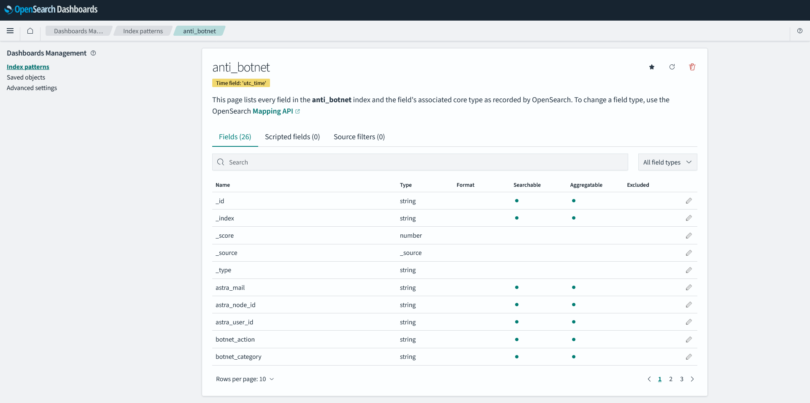
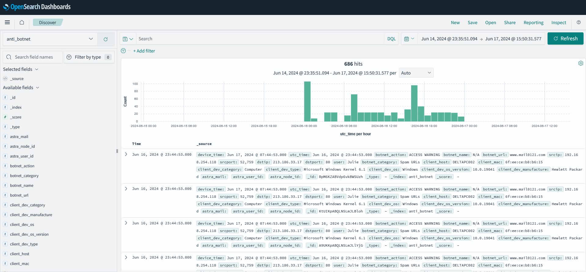
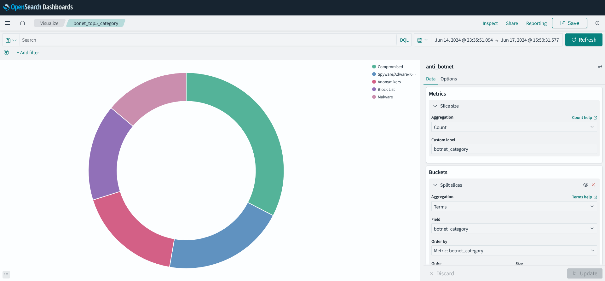

# Archived Logs Service

Log archive available timing depends on the __device’s time-zone__.The timing for handling log archives varies depending on the time zone of the device.

<table>
  <tr>
    <th>Region</th>
    <th>Processed Time</th>
  </tr>
  <tr>
    <td>Europe (UTC+0 to UTC+5)</td>
    <td>UTC 1:00</td>
  </tr>
  <tr>
    <td>Asia-Pacific (UTC+6 to UTC+14)</td>
    <td>UTC 13:00</td>
  </tr>
  <tr>
    <td>Others (UTC-12 to UTC-1)</td>
    <td>UTC 19:00</td>
  </tr>
</table>

__Note: these times are for handling log archives and do not necessarily indicate when the archive process is completed__. Use the following command to download logs from SecuReporter.
 


<details>
 <summary><code>POST</code><code>/open-api/v1/archive-logs/download</code></summary>

### Description
 Download archive logs which user-selected period for a single day within the past 31 days (excluding the current day).

### Usage Limitation
You can make up to 50 API request per `Open API Token` per Zyxel Device per hour

### Body Parameters

<table>
  <tr>
    <th>Name</th>
    <th>Type</th>
    <th>Data Type</th>
    <th>Description</th>
  </tr>
  <tr>
    <td>device_date</td>
    <td>required</td>
    <td>String</td>
    <td>format yyyy-MM-dd</td>
  </tr>
</table>

### Success Response

<table>
  <tr>
    <th>Response code</th>
    <th>Content Type</th>
    <th>Response</th>
  </tr>
  <tr>
    <td>200</td>
    <td>application/x-tar</td>
    <td>file-like object in binary mode</td>
  </tr>
</table>

### Example cURL

> ```shell
> curl -X POST https://secureporter.cloudcnm.zyxel.com/open-api/v1/archive-logs/download \
> -H "Content-Type: application/json" \
> -H "X-Authorization: Bearer your-open-api-token" \
> -d "{\"device_date\":\"2024-01-01\"}" \
> -o /Users/Downloads/archive.tar 
> ```

</details>

## Use Case

<details>
 <summary>Importing SecuReporter Log Into Self-Hosted OpenSearch</summary>

### Description
After obtaining the archive log, you can import it into your preferred analysis software or database (such as Splunk, OpenSearch, Graylog, MySQL, etc.) for further investigation. The following steps illustrate how to do this using OpenSearch as an example.

### Prerequisite

1. Python3 
2. OpenSearch server: 
   
   You can use Docker to set up an OpenSearch server. Refer to a sample `docker-compose.yml` file to create an OpenSearch container.
   
   ```bash
   docker compose up
   ```

### Steps

   
1. Change the sample settings in `sr_archive_log_spliter.py`:
   1. Change the OpenSearch IP:
      ```python
      self.opensearch_host = "localhost"
      ```
   2. Set the location and file name of the SecuReporter archive log:
      ```python
      self.archived_sr_log = os.path.join(os.path.abspath(os.getcwd()), "data", "2024-06-16.gzip")
      ```
   3. Set the location of the CSV file export:
      ```python
      self.csv_export_path = os.path.join(os.path.abspath(os.getcwd()), "csv_results")
      ```
2. Prepare the required Python libraries :
   ```bash
   pip install -r requirements.txt
   ```
3. Run the Python code:
   ```bash
   python sr_archive_log_spliter.py
   ```
4. After execution is complete, log data will be imported into OpenSearch and the CSV format file will be in **`csv_results`**.

   ```
   csv_results/
   ├── anti_botnet.csv
   ├── anti_malware.csv
   ├── application_patrol.csv
   ├── application_usage.csv
   ├── common.csv
   ├── dns_content_filter.csv
   ├── dns_filter.csv
   ├── dut_scan_statistics.csv
   ├── interface_statistic.csv
   ├── mail_protection.csv
   ├── reputation.csv
   ├── sandbox.csv
   ├── threat_protection.csv
   ├── traffic.csv
   └── web_protection.csv
   ```
5. Open OpenSearch Dashboard from your browser:

   1. Create the index patterns from OpenSearch Dashboard
      
   2. View the raw log from "Discover"
      
   3. Create your own Visualize from OpenSearch:
      

By following these steps, you can effectively import and visualize SecuReporter log data in a self-hosted OpenSearch environment.

###   Reference Files
  - [sr_archive_log_spliter.py](../use-case/sr_archive_log_spliter.py)
  - [sr_es_template.py](../use-case/sr_es_template.py)
  - [requirements.txt](../use-case/requirements.txt)
  - [docker-compose.yml](../use-case/docker-compose.yml)

</details>